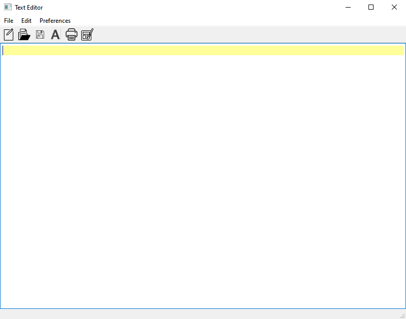
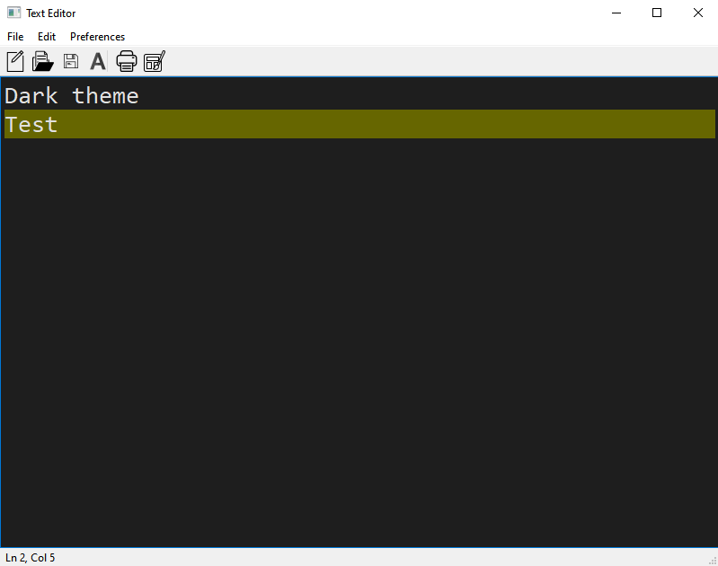

# Text Editor
A simple text editor.

### Technologies
- QT 5.12
- C++

### Features
- Create/Open/Save/Print files
- Toggle light/dark theme
- Current line highlighter
- Menu + toolbar with icons
- Font selector
- Shortcuts to essential functions (see below)
- Automatically saves user preferences (theme, font family, font size)

### Shortcuts
- **CTRL_N** = new file
- **CTRL_O**  = open file
- **CTRL_S**  = save file
- **CTRL_F**  = select font
- **CTRL_P**  = print file
- **CTRL_T**  = toggle theme
- **CTRL_+** = increase font size by 2 points
- **CTRL_-**  = decrease font size by 2 points

### Screenshots

